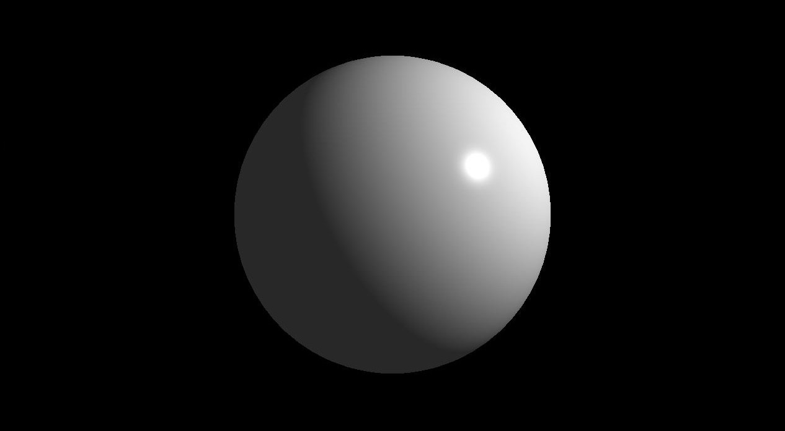

# CPU Software Rasterizer

A simple software-rasterizer in C++ I wrote to understand the OpenGL graphics pipeline.

## Features
- C++ implementation
  - generic vertex and fragment attributes
  - lambda functions as vertex and fragment shader
  - .obj and .mat loading
  - GLFW/OpenGL viewer (uploads framebuffer each frame)
- Perspective-correct attribute interpolation
- z-buffering
- back face culling
- texture mapping with filter (nearest, linear)

## Examples

### Model Loading and Texture Mapping ("Sad toaster" [Link](https://skfb.ly/on9Dn) by tasha.lime).

### Blinn-Phong Illumination (Phong Shading)

## Useful Resources
[Tiny Renderer](https://github.com/ssloy/tinyrenderer/wiki/Lesson-0:-getting-started)

[Scratchpixel Lesson](https://www.scratchapixel.com/lessons/3d-basic-rendering/rasterization-practical-implementation)

[Rasterator](https://github.com/diharaw/Rasterator)

[SRPBR](https://github.com/niepp/srpbr)

[Stack Overflow Perspective Interpolation](https://stackoverflow.com/questions/24441631/how-exactly-does-opengl-do-perspectively-correct-linear-interpolation)
