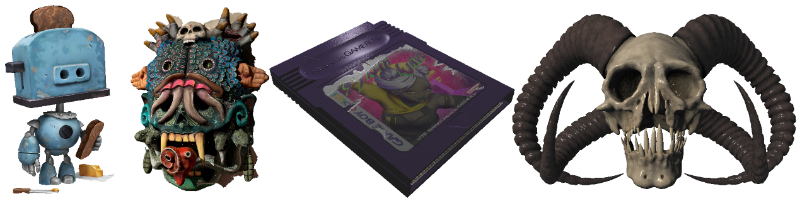
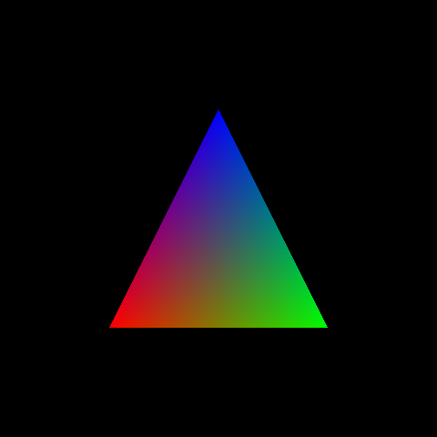
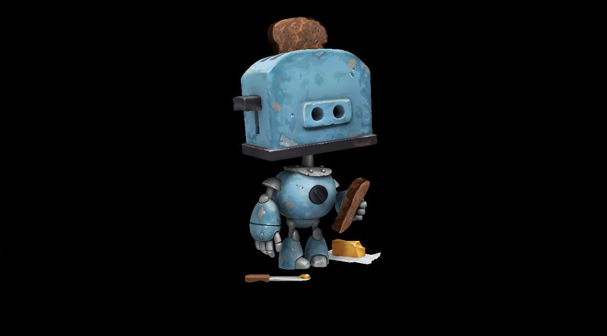
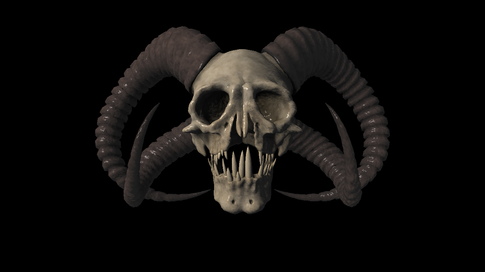
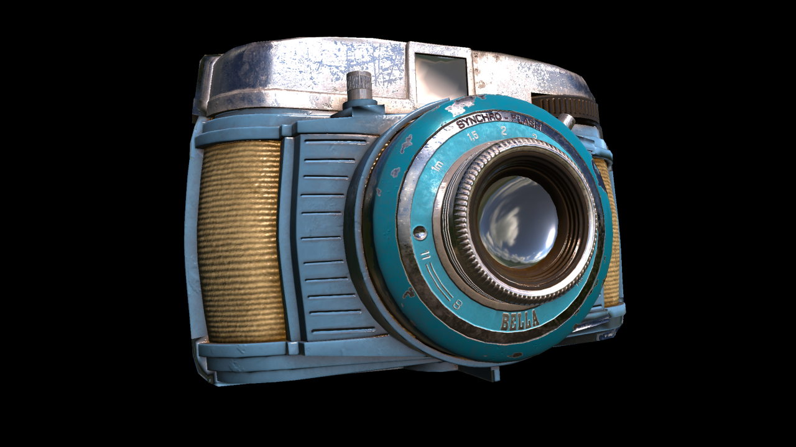
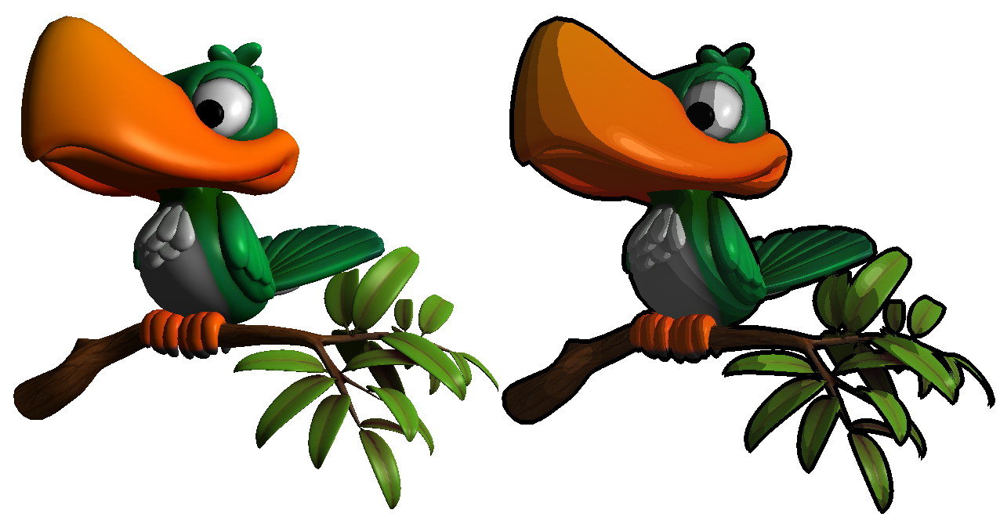
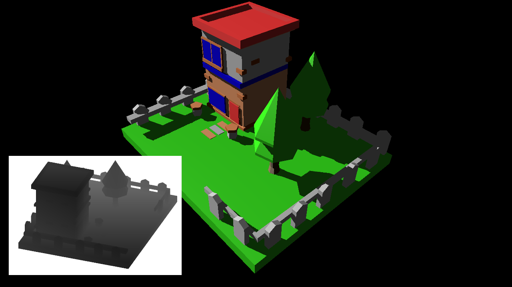
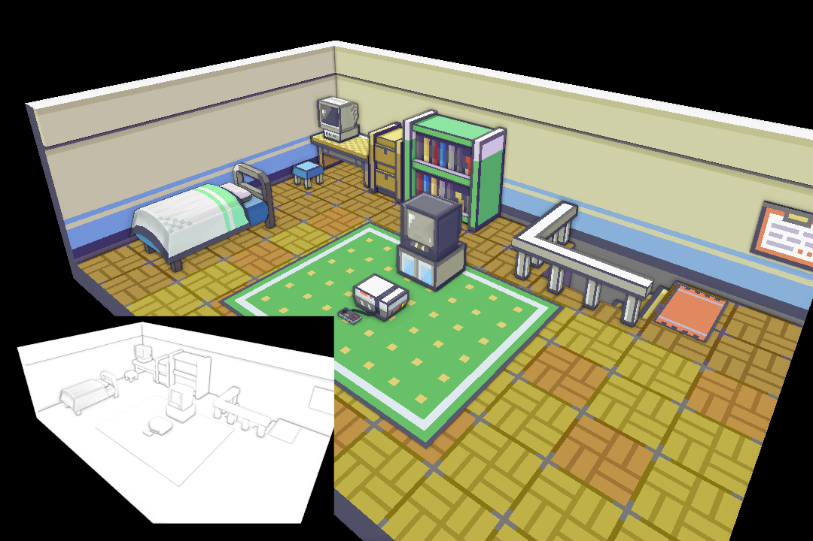

# CPU Software Rasterizer

A software-rasterizer in C++, that I wrote to get a basic understanding of the OpenGL graphics pipeline.


l.t.r. ["Sad toaster"](https://skfb.ly/on9Dn) by tasha.lime, ["Coatlicue"](https://sketchfab.com/3d-models/coatlicue-dd61c5e8c8734d9399d57c2ad04ec226) by aptass, ["Gameboy Cartridge"](https://sketchfab.com/3d-models/gameboy-cartridge-7c0160c8097a43e0a5e146bf4d7e01a1) by Karolina D, ["Demon Skull"](https://sketchfab.com/3d-models/demon-skull-0cb0efd8bd8a405f89ce5f757ecf6e8d) by Auxiar Molkhun

## Features

- C++ implementation
  - [x] generic vertex and fragment attributes
  - [x] programmable vertex and fragment shader (functors)
  - [x] generic framebuffer targets (for "offscreen" rendering) 
  - [x] small math library (2D, 3D, 4D vectors and 2x2, 3x3, 4x4 matrices)
  - [x] .obj and .mat loading
  - [x] GLFW/OpenGL viewer (uploads framebuffer each frame)
- Rasterizer
  - [x] perspective-correct attribute interpolation
  - [x] z-buffering
  - [x] texture sampler filter (nearest, linear)
  - [x] texture sampler wrapping (repeat, edge) 
  - [x] face culling
  - [x] custom framebuffer
  - [x] line rendering (wireframe rendering)
  - [x] mip map generation
  - [ ] mip map level computation
  - [ ] anisotropic filtering
  - [ ] cubemap
- Examples
  - [x] minimal examples
    - [x] colored triangle
    - [x] index buffer
    - [x] texture and sampler
    - [x] custom framebuffer
    - [x] glfw/gl viewer
    - [x] model loading
  - [x] Blinn-Phong illumination
  - [x] Cel Shading with depth buffer edge detection
  - [x] Normal Mapping
  - [x] Shadow Mapping
  - [X] Screen Space Ambient Occlusion
  - [X] Physically-based rendering + offline pre-integration    

## Examples

### Minimal setup (colored triangle)

Similar to traditional Graphic APIs we define the input and output of the shader stages, i.e. the data passing through the rasterization pipeline.

All members from `Varying` contained in the `VARYING(...)` macro are interpolated per fragment by the rasterizer.
Note, that it is mandatory to have a `Vec4 position` interpolated attribute.
```cpp
/* vertex data -> input to draw call (via Buffer) */
struct Vertex
{
    Vec3 pos;
    Vec3 color;
};

/*
 * Output of vertex stage, Input to fragment stage
 * -> position is mandatory
 * -> members to interpolate are declared by VARYING macro (member need scalar multiplication, and addition)
*/
struct Varying
{
    Vec4 position;
    Vec3 color;

    VARYING(position, color);
};

/* uniform struct accessable from both "shaders" */
struct Uniforms {};
```
Vertex and fragment shaders are written as function objects which need to be set accordingly with `onVertex` and `onFragment` (currently no default shader).
```cpp
Program<Vertex, Varying, Uniforms> program;
program.onVertex([](const Uniforms& uniform, const Vertex& in, Varying& out)
{
    out.position = Vec4(in.pos, 1.0f);
    out.color = in.color;
});

program.onFragment([](const Uniforms& uniform, const Varying& in, Vec4& out)
{
    out = Vec4(in.color, 1.0f);
});
```

Mesh data is provided to the renderer with a `Buffer` object.

```cpp
Buffer<Vertex> buffer;
buffer.primitive = ePrimitive::TRIANGLES;
buffer.vertices = { { {-0.5, -0.5, 0.5}, {1.0, 0.0, 0.0} },
                    { { 0.5, -0.5, 0.5}, {0.0, 1.0, 0.0} },
                    { { 0.0,  0.5, 0.5}, {0.0, 0.0, 1.0} } };

```
An instance of `Renderer` contains a default framebuffer with a color and depth target.

After clearing the framebuffer, a draw call can be submitted with the previously defined shader program and vertex buffer.



```cpp
/* rasterizer with framebuffer size */
Renderer rasterizer(480, 480);

/* clear framebuffer */
rasterizer.framebuffer().clear(Vec4(0, 0, 0, 1));

/* submit draw call */
rasterizer.draw(program, buffer);

/* save framebuffer as .png */
rasterizer.framebuffer().color().save("00_triangle.png");

```
## Results

Model Loading and Texture Mapping ("Sad toaster" [Link](https://skfb.ly/on9Dn) by tasha.lime.)


Blinn-Phong Illumination with diffuse, normal and ambient occlusion map ("Demon Skull" [Link](https://sketchfab.com/3d-models/demon-skull-0cb0efd8bd8a405f89ce5f757ecf6e8d) by Auxiar Molkhun)


Physically-based rendering with pre-integrated irradiance and radiance maps ("Bilora Bella 46 Camera" [Link](https://sketchfab.com/3d-models/dae-bilora-bella-46-camera-game-ready-asset-eeb9d9f0627f4783b5d16a8732f0d1a4) by [Martijn Vaes](https://sketchfab.com/MartijnVaes) licensed under [CC-BY-4.0](http://creativecommons.org/licenses/by/4.0/))


Cel-Shading with post-process edge detection on the depth buffer ("Bird" [Link](https://sketchfab.com/3d-models/bird-e63479b07d8c4ae6a69b34247d572299)
 by [Václav Pleticha](https://sketchfab.com/klidas8) licensed under [CC-BY-4.0](http://creativecommons.org/licenses/by/4.0/))


Shadow Mapping (based on "low poly house" [Link](https://sketchfab.com/3d-models/low-poly-house-02635c7c191848699e88085c2ab27538) by [cofitelle](https://sketchfab.com/cofitelle) licensed under CC-BY-4.0 [CC-BY-4.0](http://creativecommons.org/licenses/by/4.0/))


Screen-space ambient occlussion ("Pokemon FireRed - Player's Room" [Link](https://sketchfab.com/3d-models/pokemon-firered-players-room-b23b6b253207463c97db2a7092adff74) by [Wesai](https://sketchfab.com/Wesai) licensed under [CC-BY-4.0](http://creativecommons.org/licenses/by/4.0/))


## :books: Useful Resources
[Tiny Renderer](https://github.com/ssloy/tinyrenderer/wiki/Lesson-0:-getting-started)   
[Scratchpixel Lesson](https://www.scratchapixel.com/lessons/3d-basic-rendering/rasterization-practical-implementation/overview-rasterization-algorithm.html)
[Rasterator](https://github.com/diharaw/Rasterator)   
[SRPBR](https://github.com/niepp/srpbr)   
[Stack Overflow Perspective Interpolation](https://stackoverflow.com/questions/24441631/how-exactly-does-opengl-do-perspectively-correct-linear-interpolation)   
[learnopengl Tutorials](https://learnopengl.com/PBR/Lighting)   
[IBL Blogpost by Bruno Opsenica](https://bruop.github.io/ibl/)